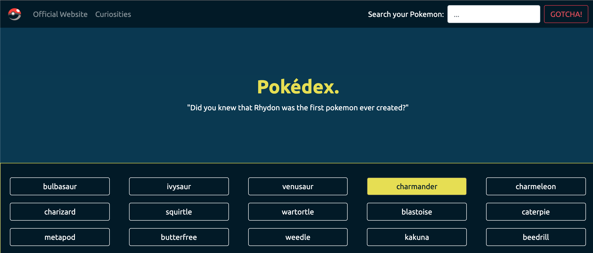
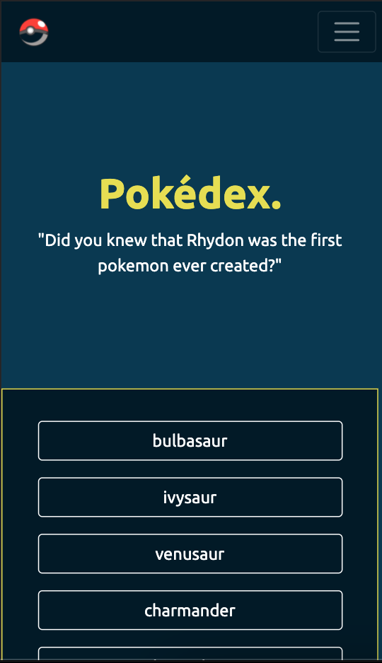

# Pokédex App.
- This project have as an objective to create a small Pokédex Library application based on HTML, CSS and JavaScript.
- The application fetches all information through an API.

- The application should be responsive in all devices:

## Build
- This application is base-build with:
- **HTML**;
- **CSS**;
- **JavaScript**.

To complement the project through the process was used:
- API - [PokeApi](https://pokeapi.co/);
- JavaScript Library - **JQuery**;
- Framework - **Bootstrap**;
- Polyfill - **Fetch** and **Promise**.

## User Experience
- The user should be able to see and interact with a list of items.
- Each item contains more detailed information about the selected Pokemon.

## Author
- LinkedIn: [João Mendonça](https://linkedin.com/in/joão-borges-mendonça-0288a26b)

## Appreciation
- CareerFoundry Mentors, Tutors and students;
- API: [Pokeapi](https://pokeapi.co/);
- Internet :)
